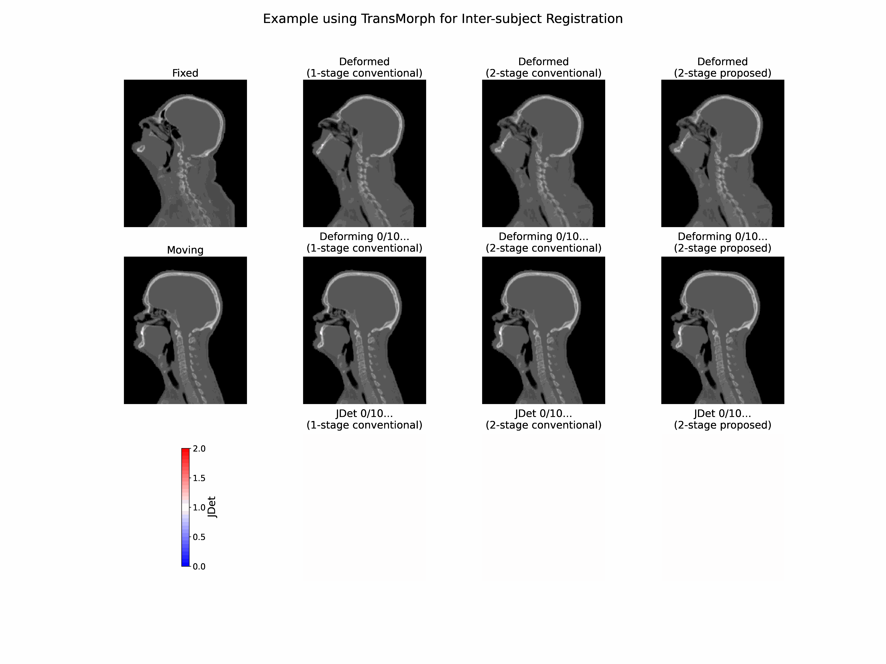

# MUsculo-Skeleton-Aware (MUSA) Deep Learning for Anatomically Guided Head-and-Neck CT Deformable Registration

This is the official **PyTorch** implementation of the paper:  

<a href="https://www.sciencedirect.com/science/article/pii/S1361841524002767">Liu, H., McKenzie, E., Xu, D., Xu, Q., Chin, R. K., Ruan, D., & Sheng, K. (2025). MUsculo-Skeleton-Aware (MUSA) deep learning for anatomically guided head-and-neck CT deformable registration. Medical Image Analysis, 99, 103351. https://doi.org/10.1016/j.media.2024.103351</a>

## Introduction
MUSA is a two-stage deformable image registration framework for head-and-neck CT. It decomposes the complex head-and-neck deformation into a bulk posture change and residual fine deformation by leveraging spatially variant regularization on bony structures and soft tissue. We highlight the importance of explicit multiresolution modeling and anatomical constraints for achieving anatomically plausible deformations.

In the animation above, we linearly scale the deformation field to visualize the "deforming process". This is **NOT** a rigorous way to analyze deformation, because the true transformation is **NOT** guaranteed to be linear.
Nevertheless, it can highlight some aspects of plausibility/implausibility of the entire process.  
For the 1-stage method, we divide the total deformation into 10 evenly spaced steps. For the 2-stage method, we apply the stage 1 and stage 2 deformations sequentially, using 5 steps for each stage (10 steps total). The difference is visible in how the head pitches upward and in the Jacobian determinant maps.

## Progress
- [x] Upload musa code
- [x] Upload training scripts
- [x] Update README.md
- [x] Upload pretrained model weights
- [x] Upload inference scripts

## Planned Enhancements
The items below are planned enhancements. They may be delayed or even skipped, depending on available time and if proper data is available.
- [ ] Visualization demos
- [ ] Test the idea with optimization-based methods (e.g., [FireANTs](https://github.com/rohitrango/FireANTs)).

## Run the code
### Environment setup
Please see requirements.txt

### Train your own model
Follow the training scripts under scripts/

For a step-by-step reproduction checklist, see [docs/reproduce_musa.md](docs/reproduce_musa.md).
For the expected preprocessed data layout, see [docs/data_format.md](docs/data_format.md).

### Dataset and preprocessing
We cannot share the processed dataset. However, the raw inter-subject datasets used in this study can be obtained from [The Cancer Imaging Archive (TCIA)](https://www.cancerimagingarchive.net/).

The preprocessing steps include the following:
- Background removal: Remove the background, including the scanning bed and patient immobilization devices.
- Standardizing orientation: Reorient all images to follow the convention:  
  - *i*: Right-to-Left (R → L)  
  - *j*: Anterior-to-Posterior (A → P)  
  - *k*: Inferior-to-Superior (I → S)  
- Centering: Rigid alignment to a common template.
- Intensity clippling and normalization: Clip image intensity values to the range [-1024, 3000] Hounsfield Units (HU) and normalize them to the range [0,1].  
- Spatial interpolation and cropping: All images are resampled to an isotropic pixel spacing of 2 mm using trilinear interpolation and then cropped to a matrix size of 160x160x192. The half-resolution images used in the first stage of the two-stage approaches are downsampled to a resolution of 4 mm and a matrix size of 80x80x96.

Segmentation for bony structures and related soft tissue organs at risk (OARs) can be obtained using existing deep learning-based autosegmentation methods, for example:  
- Vertebrae segmentation: [challenge](https://github.com/anjany/verse), [example repo](https://github.com/christianpayer/MedicalDataAugmentationTool-VerSe)  
- Head and Neck (HN) OAR segmentation: [challenge](https://structseg2019.grand-challenge.org/Home/), [example repo](https://github.com/HiLab-git/SepNet)

## Contact
Contributions and feedback are welcome! Please open an issue or submit a pull request. For direct inquiries, you can also reach me at <hjliu@g.ucla.edu>.

## Citation
If you find this repository useful in your research, please consider to cite:
    
    @article{liu2025musa,
        title = {MUsculo-Skeleton-Aware (MUSA) deep learning for anatomically guided head-and-neck CT deformable registration},
        journal = {Medical Image Analysis},
        volume = {99},
        pages = {103351},
        year = {2025},
        issn = {1361-8415},
        doi = {https://doi.org/10.1016/j.media.2024.103351},
        url = {https://www.sciencedirect.com/science/article/pii/S1361841524002767},
        author = {Hengjie Liu and Elizabeth McKenzie and Di Xu and Qifan Xu and Robert K. Chin and Dan Ruan and Ke Sheng},
    }

## Code reference
The implementation of MUSA is based on the following open-source code:
- [VoxelMorph](https://github.com/voxelmorph/voxelmorph)
- [TransMorph](https://github.com/junyuchen245/TransMorph_Transformer_for_Medical_Image_Registration)
- [LKU-Net](https://github.com/xi-jia/LKU-Net)
- [Dual-PR-Net](https://github.com/kangmiao15/Dual-Stream-PRNet-Plus)
- [LapIRN](https://github.com/cwmok/LapIRN)
- [abcd-registration-experiments](https://github.com/brain-microstructure-exploration-tools/abcd-registration-experiments)
- [spine-ct-mr-registration](https://github.com/BailiangJ/spine-ct-mr-registration)
